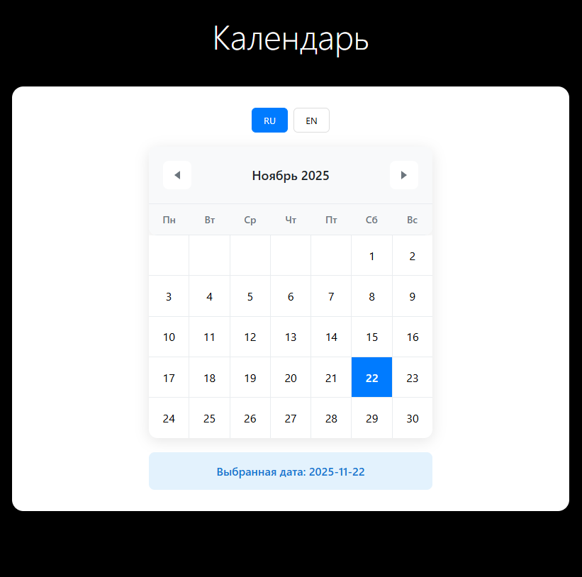
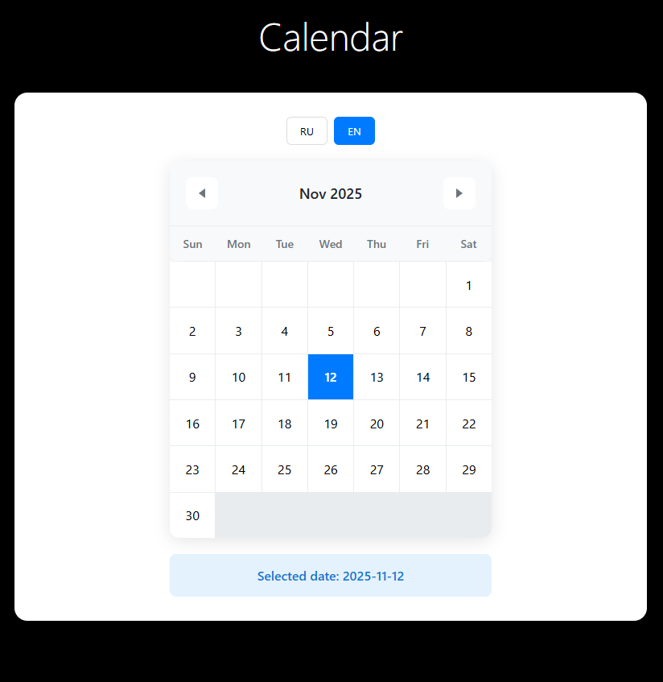

# test-rr Тестовое задание "Рабочие руки"

**Исполнитель: Яландаев Андрей**     
📧 Email: [yalanday256@gmail.com](mailto:yalanday256@gmail.com)  
📱 Telegram: [@YalanDay](https://t.me/YalanDay)

## Технологии
- NODE VERSION = v22.14.0
- Vue.js 3
- TypeScript
- Pinia
- Vue I18n

### Русская версия


### Английская версия


## Project Setup

```sh

yarn install
```

### Compile and Hot-Reload for Development

```sh

yarn dev

```
